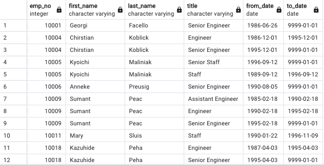
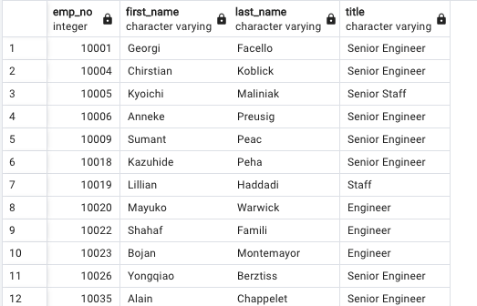
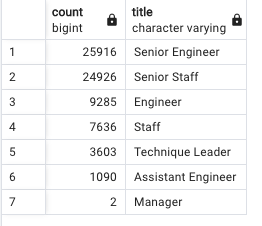
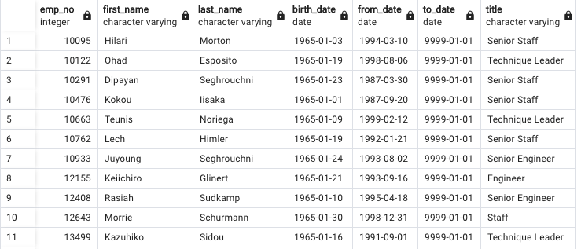
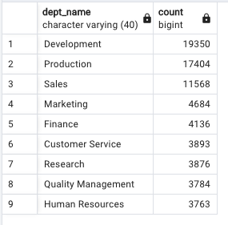
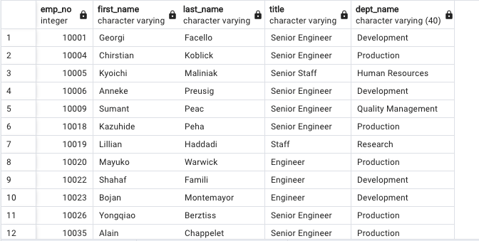

# Pewlett-Hackard-Analysis

## Overview of the Project

With a company as large as Pewlett-Hackard, it is incredibly important to track and plan for the number of employees nearing retirement. While it is important to know the number of employees that meet the criteria for retirement, it is equally important to identify current employees that can be mentored over the next few years. This natural attrition will allow for near-future promotions and also free up salary pay for current employees looking to take on more job responsibilites to replace seniored positions as they become available.

### Purpose

Utilizing data collected from various departments, the following analysis is broken down by department to allow for Human Resources and Department Managers to create roadmaps for the next 12-24 months. It will be essential to plan for upcoming retirements, as there are a large number of employees in multiple departments that are eligible for the full retirement package.

## Results 
 
Retirement Titles table for employees who are born between January 1, 1952 and December 31, 1955:

    * This table will include every title that a single employee has held throughout their time within the company. This is a significant amount of information, however may be very useful in recognizing achievments and planning inclusive retirement celebrations.

Unique Titles table that contains the employee number, first and last name, and most recent title:

    * This table will be useful for HR to identify the employees that are eligible for a full retirement package.

Retiring Titles table that contains the number of titles filled by employees who are retiring:

    * There are two titles that standout across all departments which present the most significant need for mentorship and replacement. These are 1) Senior Engineer and 2) Senior Staff. There are approx. 72,500 employees who will be eligible for retirement, with approx. 26,000 Senior Engineers and approx. 25,000 Senior Staff members.

Mentorship Eligibility table for current employees who were born between January 1, 1965 and December 31, 1965:

    * Over the next 12-24 months, it will be essential to initiate discussions with these employees about job satisfaction, promotions, and interest in participation in a mentorship program to fill impending vacant senior positions. 

## Summary

- How many roles will need to be filled as the "silver tsunami" begins to make an impact? 
    * There will be 72,458 employees who have met the criteria for a full retirement package, however not every employee will be ready, willing, or able to retire.
    
- Are there enough qualified, retirement-ready employees in the departments to mentor the next generation of Pewlett Hackard employees?
    * There are more than enough seniored employees who may choose to participate in mentoring the next generation of employees. This table breaks down the number of retirement-eligible employees by department.
        
        
    * This table contains the names and titles of every retirement-eligible employee by department. Department managers are recommended to initiate discussions about the employees participation in a mentorship program as soon as possible.
        
